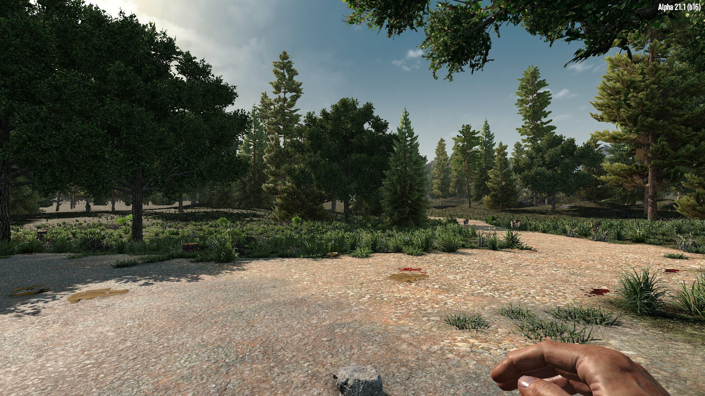

# OCB MicroSplat Roads Demo Mod - Addon for OCB MicroSplat

Spruce up vanilla road (gravel/tar) by using new textures.

Requires [OcbMicroSplat][1] (Download from [Nexusmods][3]).

You need to disable EAC to use this mod!

## In-Game Screenshots

First screen shows custom roads, second one vanilla:

## Changelog

### Version 0.1.0

- Initial version

## Compatibility

Developed initially for a21.1(b6), updated through a21.2(b14).

[1]: https://github.com/OCB7D2D/OcbMicroSplat
[2]: https://github.com/OCB7D2D/OcbMicroSplat/releases
[3]: https://www.nexusmods.com/7daystodie/mods/2873